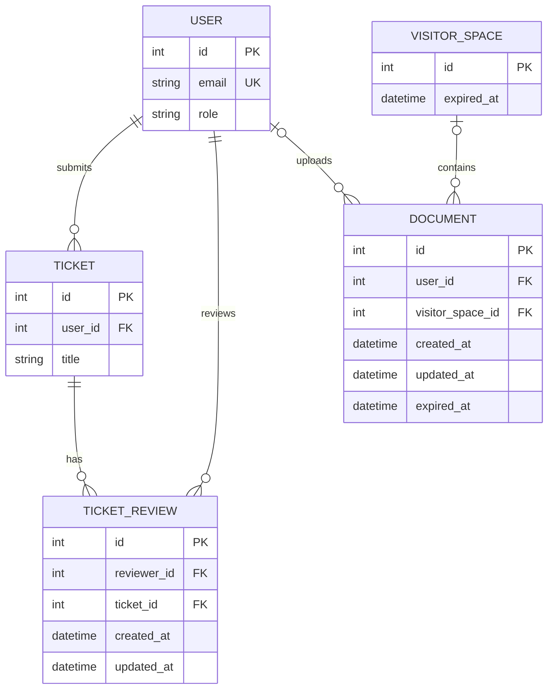

# Data Model

## Entity relationship

user_id and visitor_space_id on each Document must be exactly one non-null item.
expired_at of intern document are empty, only guest document will be set a expired_at.
